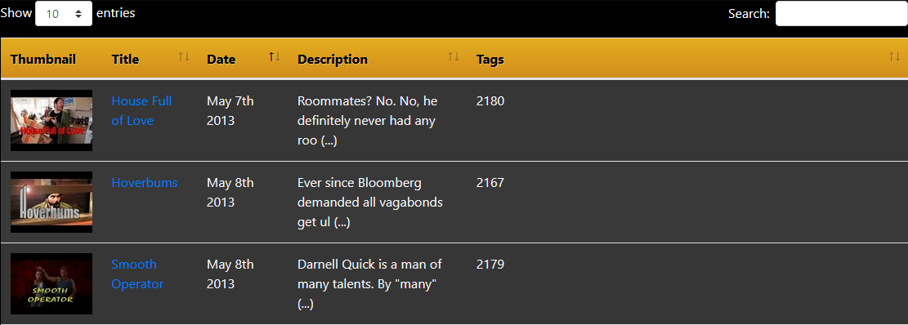

# 5 Second Films Index v0.4
Database containing information about each of the 5 Second Films, such as actors and themes, for easy reference and lookup.  

Current Features
- Datatable of every video from the 5 Second Films Youtube channel
  - Title, Date uploaded, Description, and Thumbnail
- Uses DataTables plug-in for jQuery
  - Searchable table
  - Child rows
- Data read from local JSON file

Changelog
v0.4
- Data read from local JSON file
- Description automatically truncated
  - Child row opens on click to display full description
- CSS code edited to copy original 5SF site color scheme

